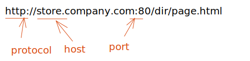

# web如何运作

## 当你在浏览器里输入一个网址时

1.  浏览器在域名系统（DNS）服务器上找出存放网页的服务器的实际地址（找出商店的位置）。
2.  浏览器发送 HTTP 请求信息到服务器来请拷贝一份网页到客户端（你走到商店并下订单）。这条消息，包括其他所有在客户端和服务器之间传递的数据都是通过互联网使用 TCP/IP 协议传输的。
3.  服务器同意客户端的请求后，会返回一个“200 OK”信息，意味着“你可以查看这个网页，给你～”，然后开始将网页的文件以数据包的形式传输到浏览器（商店给你商品，你将商品带回家）。
4.  浏览器将数据包聚集成完整的网页然后将网页呈现给你（商品到了你的门口 —— 新东西，好棒！）。
## web 存储
### 1、cookie

-   本身用于浏览器和 server 通讯。
-   被“借用”到本地存储来的。
-   可用 document.cookie = '...' 来修改。

其缺点：
- 安全性差，存储在浏览器中容易被恶意查看。（`document.getCoolie()`）
-   只能存储ASCII码字符串。
-   存储大小限制为 4KB。
-   http 请求时需要发送到服务端，增加请求数量。
-   只能用 document.cookie = '...' 来修改，太过简陋。

### 2、localStorage 和 sessionStorage

-   HTML5 专门为存储来设计的，最大可存 5M。
-   API 简单易用。
-   不会随着 http 请求被发送到服务端。

它们的区别：

-   localStorage 数据会永久存储，除非代码删除或手动删除。
-   sessionStorage 数据只存在于当前会话，浏览器关闭则清空。
-   一般用 localStorage 会多一些。

# 概念

- **跨浏览器兼容性**（Cross-browser compatibility）是一种确保您的网页能够在尽可能多的设备上运行的做法。这包括使用所有浏览器都支持的技术，为可以处理这些浏览器的浏览器提供更好的体验（逐步增强），和/或编写代码，从而使之退回到较旧的浏览器中更简单但仍可用的体验（平稳降级）。它还涉及大量测试，以查看某些浏览器是否有任何故障，然后进行更多工作来修复这些故障。

- **响应式网页设计**（Responsive Web design）是一种使功能和布局变得灵活以便它们可以自动适应不同的浏览器的做法。一个明显的例子是在桌面上的宽屏浏览器中以一种方式进行布局，但在手机浏览器中以另一种更紧凑的单列布局的网站。现在请尝试调整浏览器窗口的宽度，然后看看会发生什么。

- **性能**（Performance）意味着要尽快加载网站，而且还应使其直观易用，以使用户不会碰壁离开。

- **无障碍**（Accessibility）意味着使您的网站可供尽可能多的不同类型的人使用（相关概念是多样性和包容性，以及包容性设计）。这包括视力障碍，听力障碍，认知障碍或肢体障碍的人。它也不仅仅局限于残疾人——也包含年轻人或老年人、来自不同文化的人、使用移动设备的人、或网络连接不可靠或缓慢的人。

- **国际化**（Internationalization）意味着使网站可以供来自不同文化背景的人使用，这些人会说和您不同的语言。这一点可以考虑一些技术手段（例如，更改布局以使其对于从右到左甚至垂直的语言仍然可以正常使用）和人为手段（例如，使用简单的非俚语，以便使以您的语言作为第二或第三语言的人更可能理解您的文字）。

- **隐私与安全**（Privacy & Security）这两个概念相关但不同。隐私是指允许人们私下从事其业务，而不是监视他们或收集您绝对不需要的更多数据。安全性是指以安全的方式构建您的网站，以使恶意用户无法从您或您的用户那里窃取信息。

# 跨域资源共享 CORS（Cross-origin Resource Sharing ）

CORS 是 HTTP 的一部分，它允许服务端来指定哪些主机可以从这个服务端加载资源。

## 源（Origin）

Web 内容的源由用于访问它的 URL 的方案（协议）、主机名（域名）和端口定义。只有当协议、主机和端口都匹配时，两个对象才具有相同的源。

## 同源策略

同源策略是一个重要的安全策略，它用于限制一个源的文档或者它加载的脚本如何能与另一个源的资源进行交互。它能帮助阻隔恶意文档，减少可能被攻击的媒介。



## 实现

- 在服务器端设置http的header

```js
// node.js express
app.get('/listUsers', function (req, res) {
  res.set('Access-Control-Allow-Origin', 'http://localhost:8080');
   ...
})
```

# 参考资料

1. [mdn 浏览器的同源策略](https://developer.mozilla.org/zh-CN/docs/Web/Security/Same-origin_policy)
2. [15 张精美动图全面讲解 CORS](https://juejin.cn/post/6856556746706518024)
3. [cors](https://web.dev/cross-origin-resource-sharing/?utm_source=devtools)